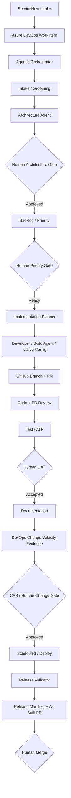

# Target Architecture

## Systems
- ServiceNow PDI: intake, runtime platform, change governance, native development
- Azure DevOps: planning/work items
- GitHub: code/source, PRs, durable engineering knowledge
- VS Code: local engineering cockpit
- Copilot / Claude / Codex / Gemini: interchangeable specialists
