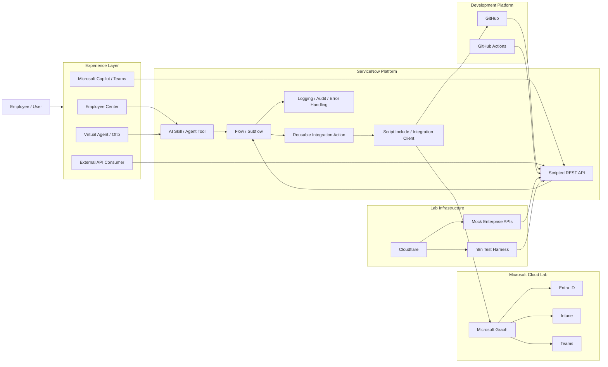

# ServiceNow AI & Integration Portfolio — Baseline Architecture

## Purpose

This portfolio demonstrates production-oriented ServiceNow development, integration engineering, AI orchestration, and enterprise architecture patterns using isolated lab environments and synthetic data.

The portfolio is designed around one core principle:

> **Build secure, reusable enterprise capabilities first. Add AI as an orchestration and experience layer second.**

No proprietary employer code, credentials, configuration, data, internal URLs, or customer information should be included.

---

# 1. Reference Architecture



---

# 2. Architectural Layers

## Experience Layer

Responsible only for how a user initiates or interacts with a capability.

Examples:

* Employee Center
* Virtual Agent / Otto
* Now Assist
* Microsoft Teams
* Microsoft Copilot
* REST API
* Workspace action
* Catalog item

Business logic should not be tightly coupled to the experience layer.

---

## AI Orchestration Layer

Responsible for:

* understanding intent
* collecting conversational context
* determining the appropriate approved tool
* summarizing information
* presenting results
* assisting with classification or recommendation

AI should not independently own:

* credential generation
* authorization
* identity validation
* approval policy
* security decisions
* irreversible high-risk actions

These should remain deterministic.

---

## Business Capability Layer

Reusable ServiceNow flows and subflows contain the business process.

Examples:

```text
Secure Account Recovery
Device Compliance Remediation
Repository Change Validation
Access Provisioning
External System Synchronization
```

The same capability should ideally be callable from multiple interfaces.

```text
Now Assist ──────┐
Catalog Item ────┤
REST API ────────┼──> Reusable Subflow
Workspace ───────┤
Virtual Agent ───┘
```

---

# 3. Integration Layer

Preferred order:

```text
1. OOB ServiceNow capability
2. OOB spoke/action
3. Custom Flow Designer action
4. RESTMessageV2 / SOAP
5. Script Include integration client
6. External middleware when justified
```

Do not introduce external middleware solely because it is available.

---

## Example Integration Pattern

```text
ServiceNow Subflow
        ↓
Custom Action
        ↓
Connection / Credential Alias
        ↓
Integration Client
        ↓
External API
```

The integration client should handle:

* request construction
* response normalization
* errors
* correlation IDs
* logging
* pagination when needed
* rate-limit handling
* retry strategy

---

# 4. Inbound Integration Pattern

```text
External Platform
      ↓
Webhook
      ↓
Scripted REST API
      ↓
Authentication / Signature Validation
      ↓
Schema Validation
      ↓
Idempotency Check
      ↓
Business Capability
      ↓
ServiceNow Record / Workflow
```

Every production-oriented webhook example should consider:

* authentication
* payload validation
* duplicate events
* replay protection
* correlation IDs
* retry behavior
* malformed payloads
* 4xx vs 5xx responses
* asynchronous processing

---

# 5. Outbound Integration Pattern

```text
ServiceNow
    ↓
Reusable Action
    ↓
OAuth / Credential Alias
    ↓
REST API
    ↓
External System
```

Credentials should never be:

* hard coded
* stored in scripts
* committed to GitHub
* exposed to AI prompts
* included in screenshots

---

# 6. Lab Environment

## ServiceNow

```text
Personal Developer Instance

Purpose:
- Flow Designer
- Workflow Studio
- Script Includes
- Scripted REST APIs
- RESTMessageV2
- OAuth
- Integration development
- Catalog
- CMDB demonstrations
```

## Microsoft

```text
Microsoft 365 Business Premium + Copilot

Purpose:
- Entra ID
- Intune
- Microsoft Graph
- Teams
- Copilot
- Test users
- App registrations
- OAuth
```

## GitHub

```text
Purpose:
- Portfolio repositories
- REST API
- GraphQL API
- Webhooks
- GitHub Actions
- DevOps integration projects
```

## Cloudflare

```text
Purpose:
- DNS
- TLS
- secure lab ingress
- Cloudflare Tunnel
```

## n8n

```text
Purpose:
- external API simulator
- webhook generator
- failure testing
- delayed callbacks
- synthetic SaaS system
- asynchronous integration testing
```

---

# 7. Portfolio Repository Structure

```text
servicenow-project-name/
│
├── README.md
│
├── docs/
│   ├── architecture.md
│   ├── security.md
│   ├── design-decisions.md
│   ├── testing.md
│   └── lessons-learned.md
│
├── diagrams/
│   ├── logical-architecture.md
│   ├── sequence-diagram.md
│   └── data-flow.md
│
├── servicenow/
│   ├── script-includes/
│   ├── business-rules/
│   ├── scripted-rest/
│   ├── custom-actions/
│   └── subflows/
│
├── examples/
│   ├── request.json
│   └── response.json
│
├── tests/
│   └── test-cases.md
│
└── screenshots/
```

---

# 8. Standard Project README Structure

Every project should answer these questions.

## Business Problem

What enterprise problem is being solved?

## Requirements

What must the solution accomplish?

## Architecture

Show the systems and ServiceNow components involved.

## ServiceNow Components

Document:

* tables
* flows
* subflows
* Script Includes
* REST APIs
* actions
* decision tables
* properties
* connection aliases

## External Systems

Document:

* API
* authentication
* permissions
* request/response contract

## Technical Decisions

Explain:

* why ServiceNow owns the process
* why a spoke was or was not used
* why code was required
* why middleware was or was not used
* where AI belongs
* where AI deliberately does not belong

## Security

Document:

* least privilege
* credential handling
* ACLs
* authorization
* validation
* logging
* sensitive-data handling

## Failure Handling

Test:

```text
400
401
403
404
409
429
500
Timeout
Malformed payload
Duplicate event
Out-of-order event
```

## Testing

Include positive, negative, security, and edge-case scenarios.

## Results

Explain the technical and business outcome.

## Lessons Learned

Describe what you would change in a production implementation.

---

# 9. Development Standards

* [ ] No hard-coded sys_ids where configuration is appropriate.
* [ ] No credentials in source code.
* [ ] Use connection and credential aliases where applicable.
* [ ] Keep business logic out of AI prompts.
* [ ] Prefer reusable subflows.
* [ ] Prefer reusable integration actions.
* [ ] Keep integrations isolated from UI logic.
* [ ] Use deterministic authorization.
* [ ] Validate inbound requests.
* [ ] Design webhook handlers for idempotency.
* [ ] Handle rate limiting.
* [ ] Log failures without exposing secrets.
* [ ] Document API permissions.
* [ ] Use synthetic portfolio data.
* [ ] Document OOB alternatives.
* [ ] Explain configuration versus customization decisions.
* [ ] Include testing evidence.
* [ ] Include architecture diagrams.
* [ ] Include security considerations.
* [ ] Include technical-debt considerations.

---

# 10. Portfolio Design Principle

The goal of each project is not to prove:

> “I can make an API call.”

The goal is to demonstrate:

> “I can design, secure, implement, test, operate, and explain a maintainable enterprise integration on the ServiceNow platform.”

