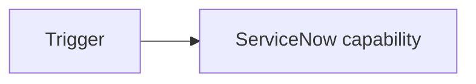

# <Capability> — As-Built

## Executive summary

## Requirement / outcome

## Architecture

## Components changed

## Data model

## Automation / flows

## Code / configuration

## Integrations / authentication

## Security

## Dependencies

## Testing / evidence

## Operations / support

## Rollback / disable

## Decision records

## Known limitations

## Traceability
